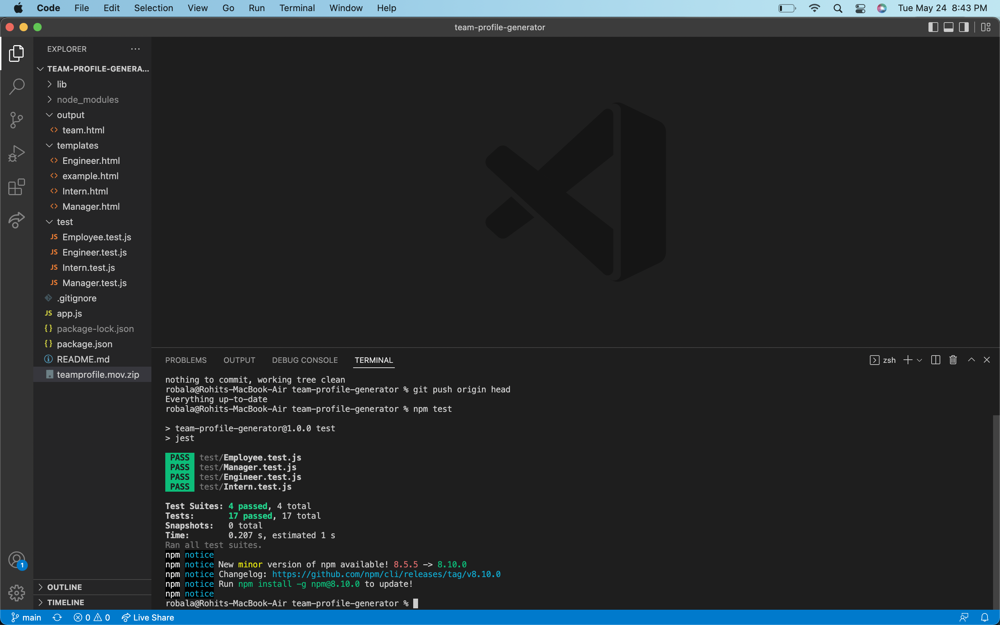
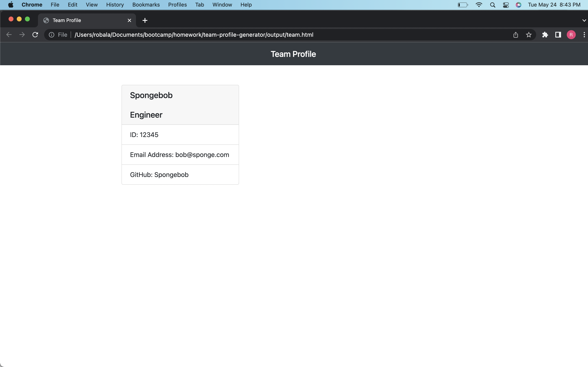

# team-profile-generator

## Description

This application uses the command line to allow the user to create user profiles for employees.

## Install

dependencies are installed just run npm install on the root after cloning the repo

## Usage 

This is to be used in the command line(CLI) just run node index.js

## Technologies

HTML
CSS
Node
Inquirer
Jest
Git

## Test

To run the tests, run npm test in the root.

## Video Walkthrough

## Screenshots

